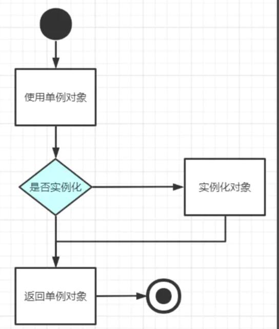

# 核心
* 保证一个类仅有一个实例，并提供一个访问它的全局访问点
* 是指在内存中只会创建且创建一次对象的设计模式
* 在程序中多次使用同一个对象且作用相同时，为了防止频繁地创建对象使得内存飙升，单例模式可以让程序仅在内存块中创建一个对象，让所有需要调用的地方都共享这一单例对象
* 用途：提高页面性能，避免不必要的 DOM 操作
* 场景：当点击登录按钮时，页面中可能会出现一个弹框，而这个弹框是唯一的，无论点多少次登录按钮，弹框只会被创建一次

# 单例模式的类型
* 懒汉式：在真正需要使用对象时才去创建该单例类对象
* 饿汉式：在类加载时已经创建好该单例对象，等待被程序使用
## 懒汉式创建单例对象
* 懒汉式创建对象的方法是在程序使用对象前，先判断该对象是否已经实例化（判空），若已实例化直接返回该类对象，否则执行实例化操作

```java
    public class Singleton {
        private static Singleton singleton;
        private Singleton () {}
        public static Singleton getInstance () {
            if (singleton == null) {
                singleton = new Singleton()
            }
            return singleton
        }
    }
```

## 饿汉式创建单例对象
* 饿汉式在类加载时已经创建好该对象，在程序调用时直接返回该单例对象即可，即在编码时就已经指明了要马上创建这个对象，不需要等到被调用时再去创建
```java
    public class Singleton {
        private static final Singleton singleton = new Singleton()
        private Singleton() {}
        public static Singleton getInstance() {
            return singleton
        }
    }
```
* 类在加载时会在堆内存中创建一个 Singleton 对象，当类被卸载时，Singleton 对象也随之消亡了

